# NBBs 数据对齐

百度地图爬取的瓦片卫星图 与 无人机拍摄标注图 不对应，需要逐瓦片进行仿射变换对应。 

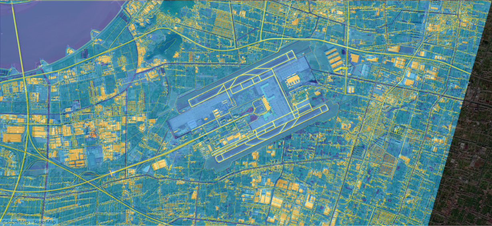 
<b>萧山机场对齐</b> 

## 1. NBBs 特征点匹配

1. 方法背景：特征图高相应位置 暗含 此类物体的特异性特征位置，可作为 A.B 的稀疏结构匹配

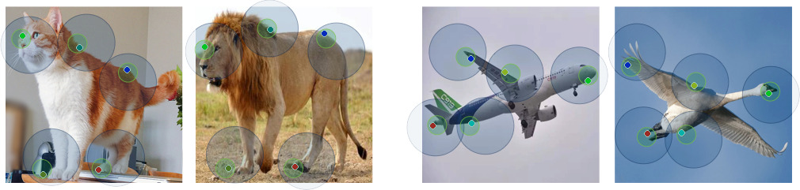

2. 方法步骤 & 加速

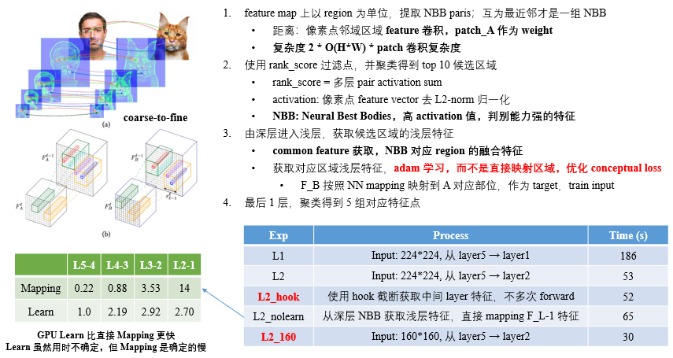

3. 卫星图标注图跨域粗对齐

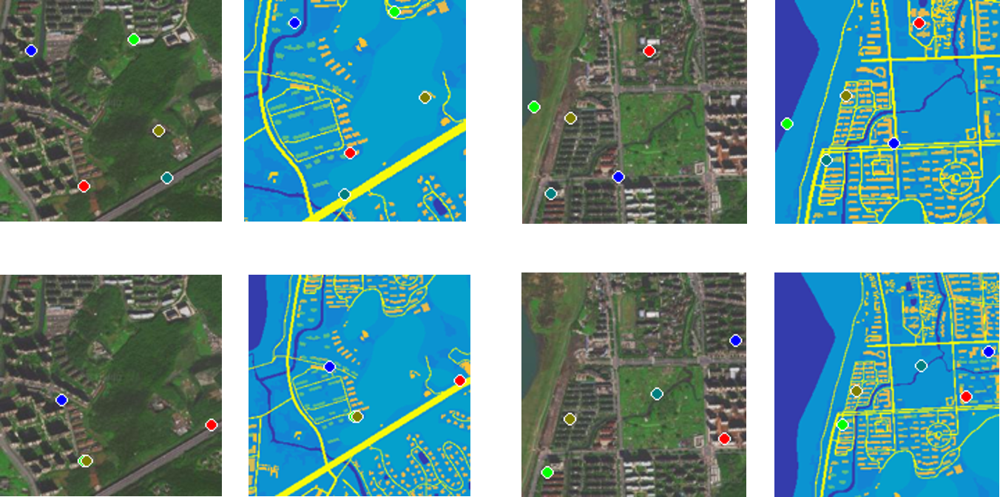

4. 根据粗对齐仿射矩阵统计结果，获取变换矩阵 scale / rotation 合理变化范围

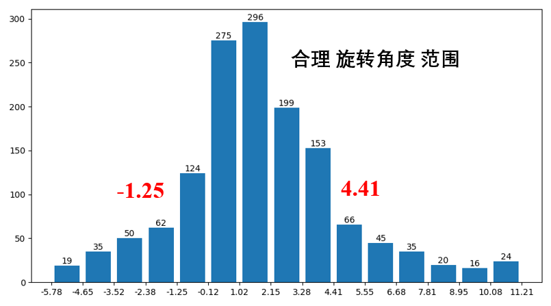
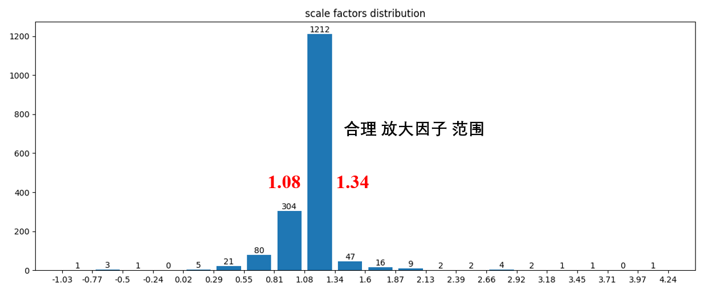

## 2. Road mask 同域匹配 先验暴搜 + 启发式边界探索

1. 百度地图 road mask 爬取

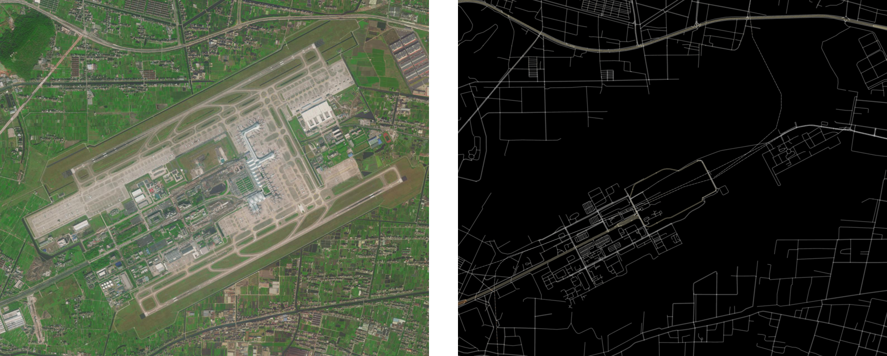

2. 提取卫星图和标注图 road mask，转化为同域匹配问题

3. 同域匹配三种思路

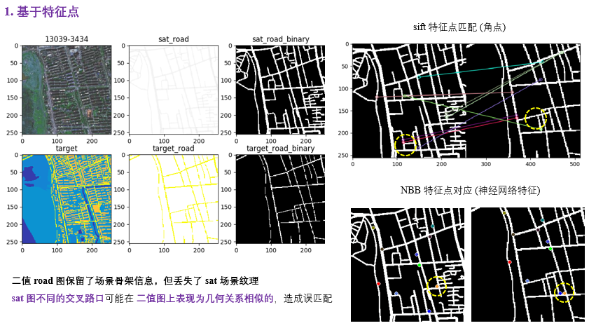  
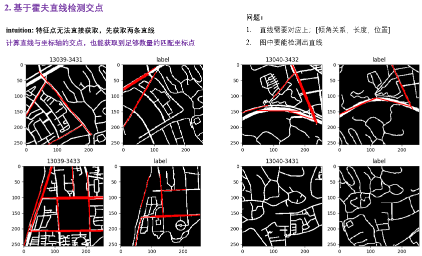  
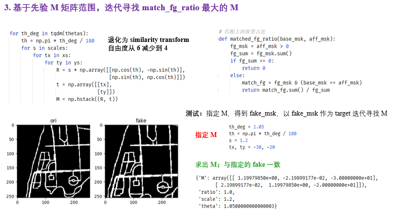

4. 先验矩阵范围内，暴搜前景 iou 最大仿射矩阵，匹配结果

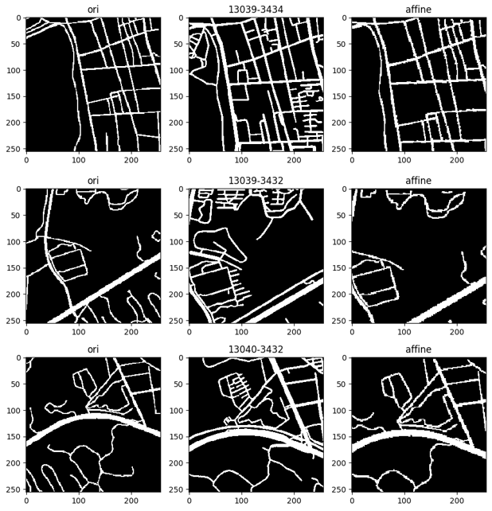

5. 落在边界矩阵 启发式边界探索 发现最优解

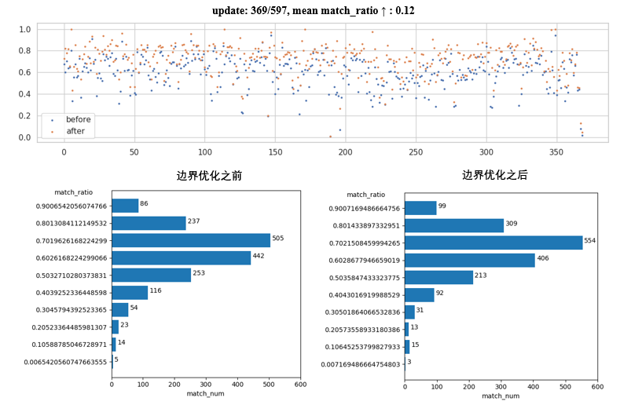

6. 匹配统计信息，77% 优质匹配结果

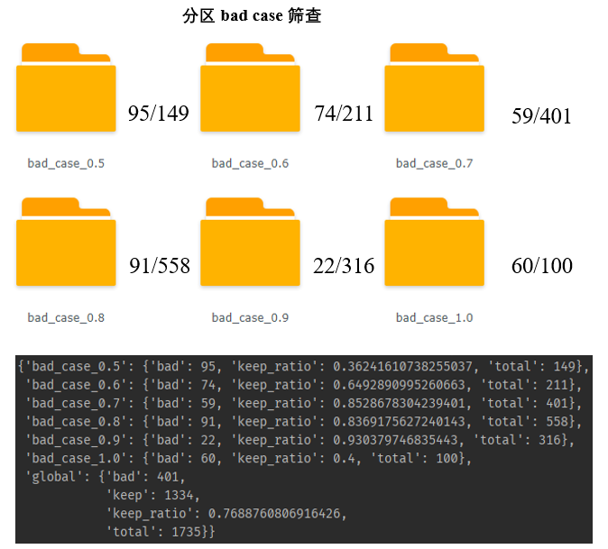

## Reference

- Neural Best-Buddies in PyTorch: https://github.com/kfiraberman/neural_best_buddies
- Aberman K, Liao J, Shi M, et al. Neural best-buddies: Sparse cross-domain correspondence[J]. ACM Transactions on Graphics (TOG), 2018, 37(4): 1-14.

