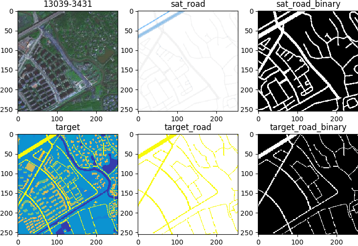

# NBBs

问题：百度地图爬取的瓦片卫星图 与 无人机拍摄标注图 不对应，需要逐瓦片进行仿射变换对应。 

## 数据发现

爬取杭州地区瓦片卫星图，使用 pretrained_model 编码图像，聚类发现场景特点。

聚类簇数：图1 为 **簇数** 与 **簇数量方差** 关系，取折线谷值 10 为簇数，兼顾均衡与场景粒度。

聚为 10 类场景，**每类场景图像** 与 **簇空间位置** 如下图。

- 聚类散点图，中心倾向于复合场景，四周倾向于单一场景，如农田、水域、森林；
- 聚类中心 encoder 向量，可辅助于特定场景图像的爬取。

采样杭州 5 区数据，**计算每个瓦片分割 acc，从空间上直观发现困难场景**。

- river 中包含较多困难场景，簇 6：密集的居民区，房屋尺寸较小。
- 标注噪声也影响 acc，与大面积同类的水域，森林相比，密集居民区 不用类别边界存在较多标注噪声。

## 数据对齐

在针对困难场景进行多采样后，进行数据对齐，缓解标注噪声的影响。

### 1. NBBs 特征点匹配

1. 方法背景：特征图高相应位置 暗含 此类物体的特异性特征位置，可作为 A.B 的稀疏结构匹配

2. 方法步骤 & 加速

3. 卫星图标注图跨域粗对齐

4. 根据粗对齐仿射矩阵统计结果，获取变换矩阵 scale / rotation 合理变化范围

### 2. Road mask 同域匹配 先验暴搜 + 启发式边界探索

1. 百度地图 road mask 爬取

2. 提取卫星图和标注图 road mask，转化为同域匹配问题

3. 同域匹配三种思路

  
  

4. 先验矩阵范围内，暴搜前景 iou 最大仿射矩阵，匹配结果

5. 落在边界矩阵 启发式边界探索 发现最优解

6. 匹配统计信息，77% 优质匹配结果

## Reference

- Neural Best-Buddies in PyTorch: https://github.com/kfiraberman/neural_best_buddies
- Aberman K, Liao J, Shi M, et al. Neural best-buddies: Sparse cross-domain correspondence[J]. ACM Transactions on Graphics (TOG), 2018, 37(4): 1-14.

